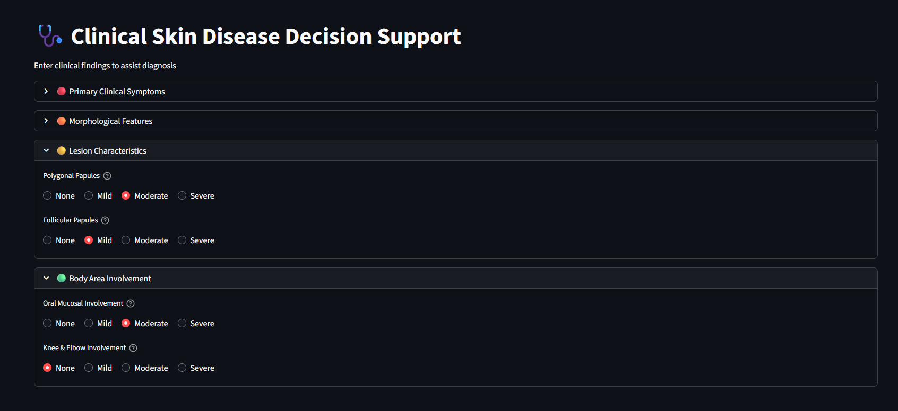
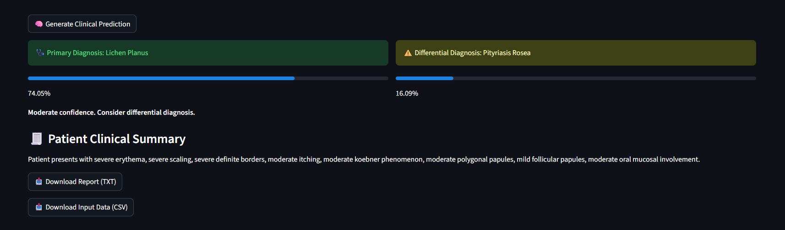

# 🩺 Clinical Skin Disease Decision Support System

An end-to-end **Machine Learning application** that predicts dermatological diseases using clinical symptoms and provides **doctor-friendly outputs** including top-2 diagnoses and patient summaries.

---

## 🚀 Live Demo

👉 https://your-app-name.streamlit.app

---

## 📌 Problem Statement

Skin disease diagnosis often requires analyzing multiple clinical symptoms.  
This project builds a machine learning system to **assist clinical decision-making** by predicting the most likely disease from structured patient data.

---

## 🌟 Key Features

- 🩺 Doctor-friendly Streamlit interface  
- 🔍 Top-2 predictions (Primary + Differential diagnosis)  
- 📊 Confidence scores  
- 🧾 Automated patient clinical summary  
- 📥 Downloadable report (TXT & CSV)  
- ⚡ Fast and lightweight model  

---

## 🖥️ Application Preview




---

## 📊 Dataset

- 366 patient records  
- 34 clinical features  
- 6 disease classes  

### Diseases:
- Psoriasis  
- Seborrheic Dermatitis  
- Lichen Planus  
- Pityriasis Rosea  
- Chronic Dermatitis  
- Pityriasis Rubra Pilaris  

---

## 🧠 Machine Learning Approach

### Models Evaluated
- Logistic Regression ✅ (Final Model)
- Random Forest
- Support Vector Machine (SVM)
- XGBoost

### Why Logistic Regression?
- High accuracy (~97%)  
- Fast inference  
- Interpretable  
- Suitable for deployment  

---

## 📈 Model Performance

- Accuracy: **97%+**
- Weighted F1 Score: **97%+**
- Stable cross-validation results

---

## 🛠️ Tech Stack

- Python  
- Scikit-learn  
- Pandas / NumPy  
- Streamlit  
- Joblib  

---

## ⚙️ Run Locally

```bash
git clone https://github.com/your-username/repo-name.git
cd repo-name
pip install -r requirements.txt
streamlit run app/streamlit_app.py
```

---

## 💡 What I Learned

- Building end-to-end ML systems
- Converting models into real-world applications
- Designing user-friendly interfaces for healthcare use cases
- Importance of deployment over just model accuracy

---

## 🔮 Future Improvements

- Image-based diagnosis using deep learning
- Patient history integration
- Cloud deployment with scalable backend

---

## 👩‍💻 Author

Brintha Devi M

⭐ If you found this project useful, feel free to star the repo!